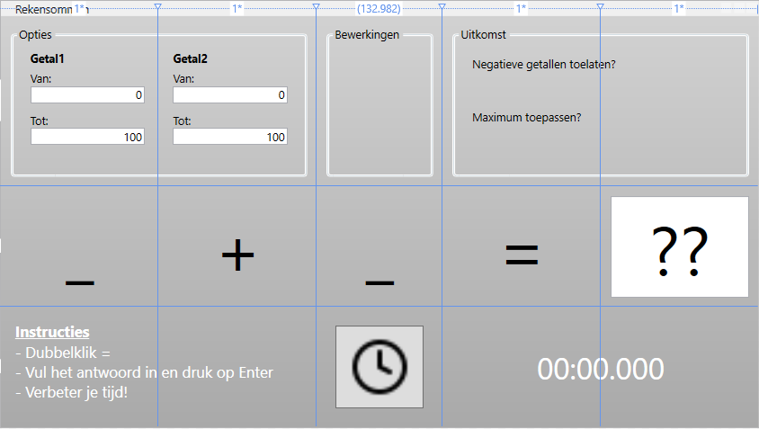
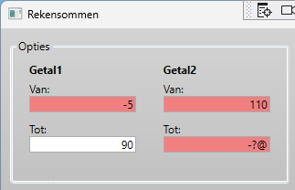
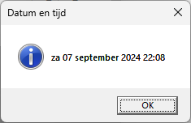
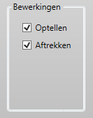
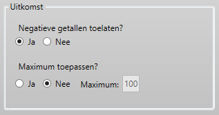

# Rekensommen
Een applicatie die willekeurige rekensommen genereert en de uitkomst controleert.



## Deel 1 - Validatie
- Maak een ***Range_TextChanged*** event-procedure aan voor 1 van de 4 tekstvelden die de range van de 2 getallen bepalen
- Zorg ervoor dat de achtergrondkleur gewijzigd wordt naar *LightCoral* wanneer de waarde:
	- kleiner is dan 0
	- groter is dan 100 
	- geen geldig getal is

```
textBox.Background = Brushes.LightCoral;
```


- Gebruik nu één en dezelfde event-procedure voor alle 4 de tekstvelden

## Deel 2 - KeyDown
- Maak één ***Range_KeyDown*** event-procedure aan voor de 4 tekstvelden
- Zorg ervoor dat de gebruiker enkel cijfers kan invoeren in de tekstvelden. 
	- Gebruik de *Key*-eigenschap van de *KeyEventArgs*-eventdata om te controleren of de toets een cijfer is
	- Gebruik de *e.Handled*-eigenschap om te voorkomen dat de invoer wordt verwerkt

## Deel 3 - MouseDoubleClick
- Zorg dat de *StartExercise*-methode wordt uitgevoerd wanneer de gebruiker dubbelklikt op het *equalsLabel*. Gebruik het event *MouseDoubleClick* 
- Gebruik de *ChangedButton*-eigenschap van de *MouseButtonEventArgs*-eventdata om te controleren of de linkermuisknop werd gebruikt

## Deel 4 - StartExercise
- Vervolledig de *StartExercise*-methode zodat deze een willekeurige som genereert en de uitkomst in een variabele bewaart (TODO 1 + 2)

## Deel 5 - KeyDown
- Maak een ***resultTextBox_KeyDown*** event-procedure aan voor de *resultTextBox*
- Zorg ervoor dat de CheckResult-functie wordt uitgevoerd wanneer de gebruiker op de *Enter*-toets drukt
	- Indien succesvol: wijzig de *IsEnabled*-eigenschap van de *resultTextBox* naar *false*
	- Indien foutief: selecteer de tekst in de *resultTextBox* zodat de gebruiker een nieuwe poging kan doen

### Deel 5.1 - CheckResult
- Vervolledig de CheckResult-functie zodat de inhoud van de textbox die als parameter wordt meegegeven, wordt gecontroleerd met de uitkomst van de berekening.
- Wijzig de achtergrondkleur van de textbox naar *LightGreen* indien de uitkomst correct is, anders naar *LightCoral*

## Deel 6 - DateTime
- Toon een messagebox met de huidige datum en tijd wanneer de gebruiker op de *showTimeButton* klikt
- Experimenteer met de aangepaste datum- en tijdnotatie (zie [DateTime.ToString](https://learn.microsoft.com/nl-be/dotnet/standard/base-types/custom-date-and-time-format-strings))



## Deel 7 - StopWatch (DispatcherTimer)
- Maak een ***DispatcherTimer*** aan als klasse variabele met de naam *_stopWatch*
	```
	DispatcherTimer _stopWatch = new DispatcherTimer();
	```
- Maak een *InitStopWatch*-methode aan die: 
	- de interval van de timer instelt op 1ms 
	- de *Tick*-event koppelt aan een event-procedure *StopWatch_Tick*
	- de *Start*-methode uitvoert van de _stopWatch
- Zorg ervoor dat in de *StopWatch_Tick* event-procedure de verstreken tijd getoond wordt in het *timerLabel*. 
	>Tip: Maak een klasse variabele *_stopWatchBegin* aan van het type DateTime en berekend telkens het verschil met de huidige tijd.
- Voer de *InitStopWatch*-methode uit in de *StartExercise*-methode (TODO 3)

## Deel 8 - Bewerkingen (CheckBox)

- Voeg een CheckBox toe in de *Bewerkingen*-GroupBox. Gebruik de benamingen:
	- addOperatorCheckBox
	- subtractOperatorCheckBox
- Beide zijn standaard aangevinkt en hebben een marge van 5

### Deel 8.1 - GetRandomOperator
- Maak een functie aan met de naam *GetRandomOperator* die een "+" of een "-" bewerking (string) teruggeeft. 
- Gebruik de *Random*-klasse om een willekeurig getal te genereren tussen 0 en 1
	- Bij een waarde 0 wordt "+" teruggegeven
	- Bij een waarde 1 wordt "-" teruggegeven
- Hou rekening met de *addOperatorCheckBox* en *subtractOperatorCheckBox* om te bepalen welke bewerkingen mogelijk zijn
- Gebruik deze functie in de *StartExercise*-methode om de bewerking te bepalen. Tip: ook de berekening van de uitkomst moet aangepast worden

## Deel 9 - Uitkomst (RadioButton)

- Voeg 2 RadioButtons toe onder het label met de tekst "Negatieve getallen toestaan". 
	- Gebruik een marge van 10 rechts en 5 onderaan
	- Geef de tweede RadioButton de naam *disallowNegativeOutcomeRadioButton* 
- Voeg 2 RadioButtons, een Label en een TextBox toe onder het label met de tekst "Maximum toepassen". 
	- Gebruik een marge van 10 rechts 
	- Geef de eerste RadioButton de naam *applyMaximumRadioButton* 
	- Geef de TextBox de naam *maximumResultTextBox* 
	- De TextBox is enkel *Enabled* wanneer de RadioButton "Ja" is aangevinkt
	> Tip: Maak een *ApplyMaximum_CheckChanged* event-procedure aan voor zowel het *Checked* als *Unchecked* event van de *applyMaximumRadioButton*
- Pas de *GetRandomNumbers* methode aan om de functionaliteit van deze RadioButtons te implementeren. 
	- Indien de *disallowNegativeOutcomeRadioButton* is aangevinkt, mag de uitkomst niet negatief zijn
	- Indien de *applyMaximumRadioButton* is aangevinkt, mag de som niet groter zijn dan de waarde in de *maximumResultTextBox*

## Deel 10 - Image
- Voeg een image toe als inhoud van de *showTimeButton*
- Gebruik de *Source*-eigenschap om de afbeelding *clock.png* in te stellen

## Extra
- Toon een messagebox wanneer een nieuwe *snelste tijd* behaald wordt. Maak hiervoor een klasse variabele aan met de naam *_highScore* van het type *TimeSpan*
